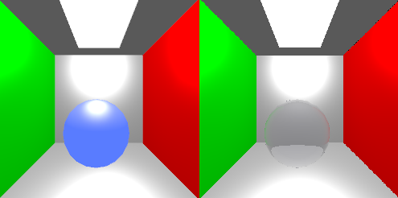
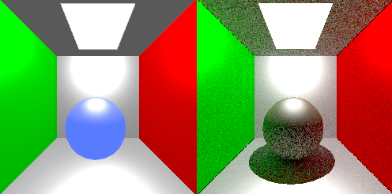
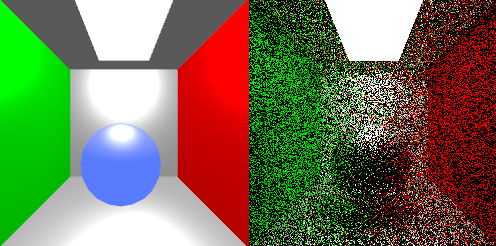
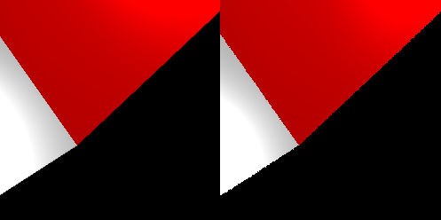
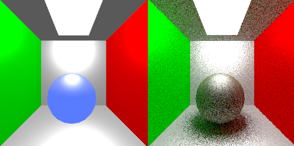
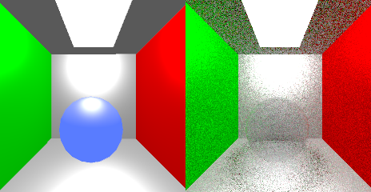
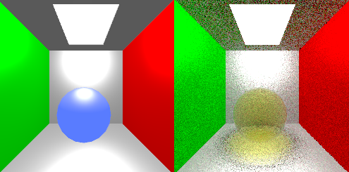

# OpenGL CPU Ray Tracer

A CPU ray tracer and path tracer for the Cornell Box scene, with OpenGL used to display the rendered image interactively.

## Features

- Physically based Blinn-Phong BRDF shading
- Reflection and refraction blended with the Schlick Fresnel approximation
- Cosine-weighted Monte Carlo sampling for indirect illumination
- Recursive path tracing with next event estimation
- Stochastic pixel sampling for anti-aliasing
- Area-light sampling for soft shadows
- Beer-Lambert absorption for coloured transparent materials
- Refractive caustics through transparent-object visibility tracing

## Rendered Results

### Refraction and Fresnel Reflection



Transparent surfaces spawn both reflected and refracted rays. Their contributions are blended with the Schlick approximation, so reflection becomes stronger at grazing angles while refraction dominates at most viewing angles.

### Monte Carlo Indirect Lighting



Indirect illumination is estimated with cosine-weighted hemisphere sampling. The result shown uses five samples and a maximum path depth of ten bounces. Direct lighting is evaluated separately and combined with the indirect contribution through the Blinn-Phong BRDF.

### Next Event Estimation



The left image uses next event estimation, while the right image relies on secondary paths finding the light by chance. Explicit light sampling greatly improves convergence at low sample counts and avoids the severe noise visible without NEE.

### Stochastic Anti-aliasing



The left image samples the centre of each pixel and exhibits regular stair-step edges. The right image uses a random position inside each pixel, converting structured aliasing into noise that converges toward a smooth edge as more samples are accumulated.

### Area Lights and Soft Shadows



Sampling multiple random positions across an area light replaces the hard shadow boundary with a smooth penumbra. The samples are averaged in the same Monte Carlo framework used for indirect illumination and anti-aliasing.

### Coloured Transparency and Absorption





Beer-Lambert absorption attenuates refracted radiance according to the material colour and the distance travelled inside the object. These comparisons use absorption parameters `(0.3000, 0.3000, 0.2000)` and `(0.3000, 0.3000, 3.2000)` respectively.

### Refractive Caustics

The concentrated yellow light beneath the transparent sphere in the second image above is a refractive caustic. The direct-light visibility routine continues tracing through transparent surfaces and multiplies the returned transmittance into the direct-light contribution, allowing refracted light to focus on nearby surfaces.

## Build and Run

Build the project with Make:

```bash
make
```

Run the Cornell Box example:

```bash
./bin/main-debug-x64-gcc.exe ./objects/cornell_box.obj ./objects/cornell_box.mtl
```

Press `R` to render. Use number keys `1`-`4` to switch between rendering modes. Modes `2`-`4` are incremental and depend on the previous mode; mode `1` can be selected independently.
